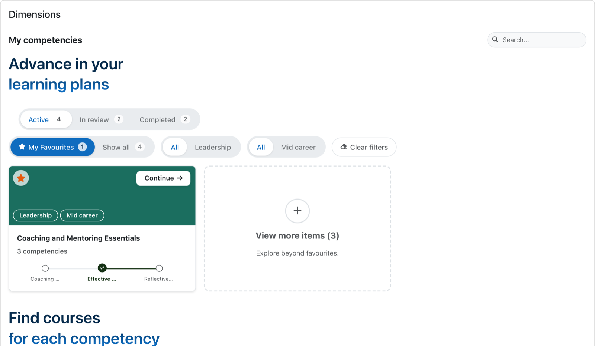
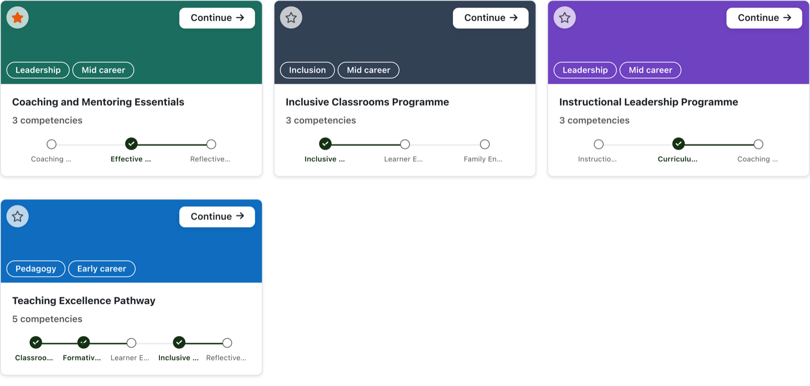
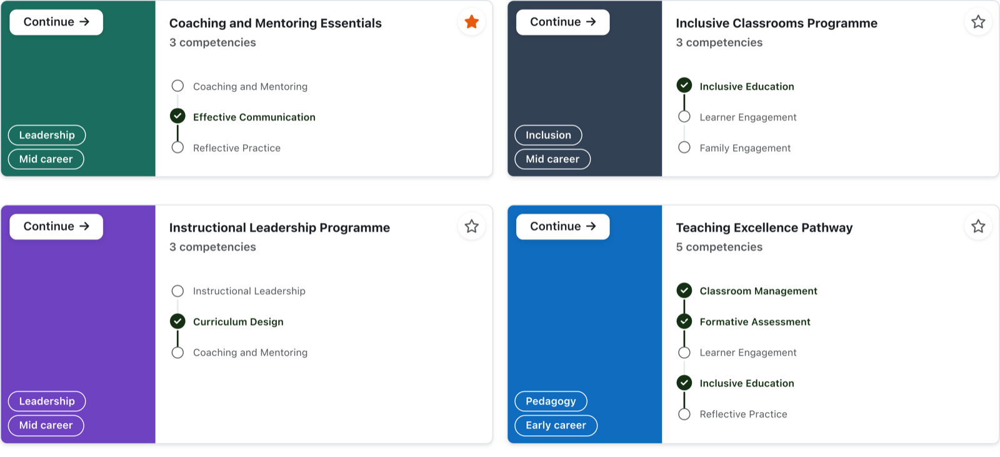
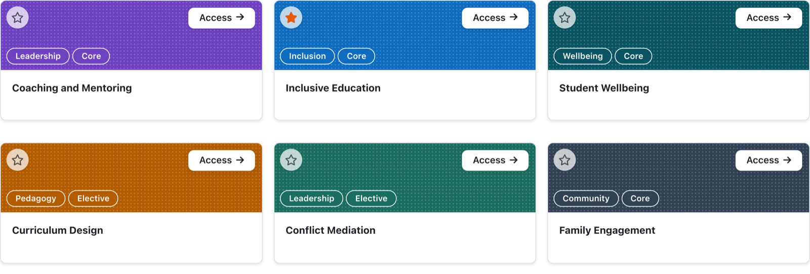
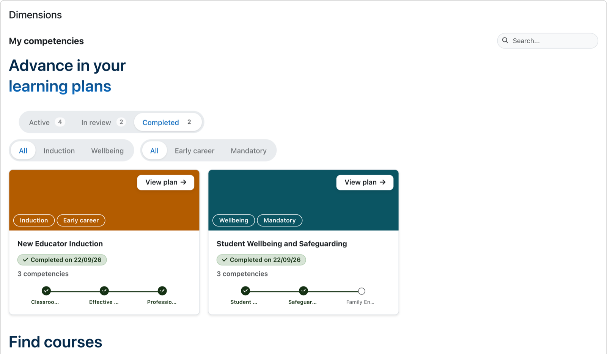
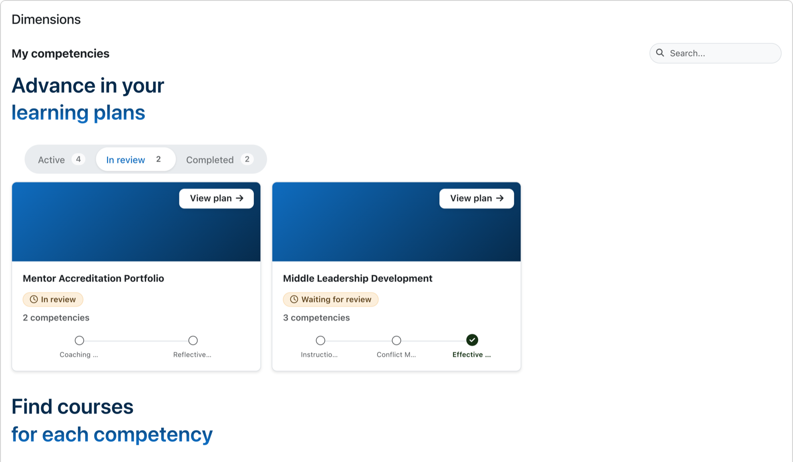
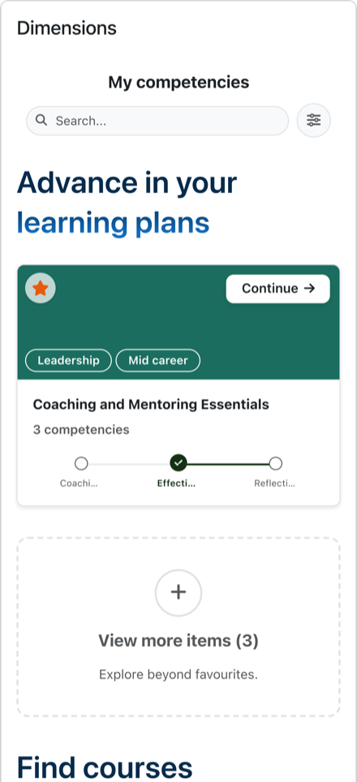
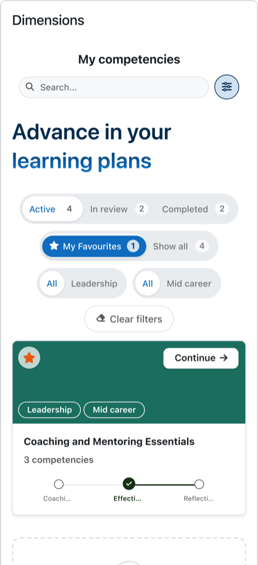
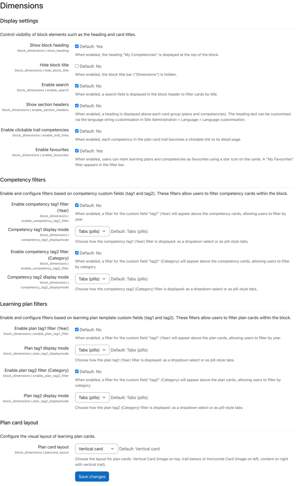

moodle-block_dimensions
=======================

Your learning path, one glance away.

A Moodle block plugin that turns the learner's active learning plans into a dashboard of visual cards: **learning plan cards** with a competency progress trail, and **competency cards** giving direct access to each competency's courses. Tag filters, instant search and per-user favourites keep even large sets of plans manageable. The block is the companion of the [Competency Dimensions](https://moodle.org/plugins/local_dimensions) plugin (`local_dimensions`) — cards carry the images, colours, tags and display modes managed there — and it creates no database tables of its own.

Requirements
------------

- Moodle 4.5 or later (tested up to Moodle 5.2)
- Core competencies enabled (`core_competency`)
- [local_dimensions](https://moodle.org/plugins/local_dimensions) v2.0 or later — the block reads all card metadata through its caches

Documentation / Documentação
-----------------------------

Full user and administrator documentation is available online in English and Portuguese:
👉 **[Competency Dimensions Documentation (GitHub Pages)](https://uaiblaine.github.io/moodle-local_dimensions-docs/)**

Motivation for this plugin

--------------------------

Moodle's competency system gives every learner a learning plan — but no fast way back into it. Day to day, plans sit several clicks deep in the profile area, and the Dashboard, the one page learners actually open every session, says nothing about them.

This block is that missing front door. It answers three questions the moment the Dashboard loads: *where am I* (the progress trail on each plan card), *what's next* (the Access/Continue button that lands on the right view), and *what matters to me* (favourites each learner curates). It follows the same philosophy as its companion plugin: no own tables, core subsystems wherever one exists — favourites, web services, caching — and a thin presentation layer over what Moodle already knows. Less plugin, more Moodle.

Installation
------------

Install the plugin like any other plugin to folder `/blocks/dimensions`.

See http://docs.moodle.org/en/Installing_plugins for details on installing Moodle plugins.

After installation the block works without any configuration: add the "Dimensions" block to the Dashboard (or any page that accepts blocks) and it renders cards from the user's active learning plans.

What learners see
-----------------

### Learning plan cards

Templates configured (in `local_dimensions`) with the *plan* display mode render as a single card per plan: cover image or colour identity, tag chips, competency count with the template's type label, and an **Access/Continue** button — the label switches to *Continue* once the plan is under way. Each card carries a **competency progress trail**: a five-step window centred on the last completed competency, with indicators when more steps exist before or after the window. Trail steps can optionally be real links; opening one first arms the "Return to plan" context so `local_dimensions`' floating button can bring the learner back from the course.

Cards come in a vertical or horizontal layout, chosen by the administrator. The horizontal layout gives the trail a column of its own, so every competency name is readable at a glance:

### Competency cards

Templates in *competencies* display mode expand into one card per competency, showing only competencies linked to at least one visible course and deduplicating competencies that appear in several plans. Each card links straight into the `local_dimensions` learner views.

### Plan status filter

Learning plans do not stop existing when they are finished. The block groups them in three buckets — **Active**, **In review** and **Completed** — and only the active one is loaded with the page; the others are fetched the first time the learner asks for them, and kept afterwards. A bucket with no plans is not drawn at all.

A completed plan shows the ratings Moodle froze when the plan was completed, not the learner's current ones, so the card always agrees with the core plan page. Plans waiting for a review, or already under review, carry their own chip:

Note that a learner needs the `moodle/competency:planviewowndraft` capability to see their own plan while it is under review — that is core's rule, not the block's, and no role holds it by default. Without it the *In review* bucket stays empty and its pill is not drawn.

### Filters and search

Each card group can offer up to two tag filters (the same tag custom fields managed in `local_dimensions`), rendered either as accessible pill radiogroups — with an animated indicator and scroll paddles when they overflow — or as native dropdowns. Filter labels reuse the admin-configured custom field names. An optional search field matches card names with a 120 ms debounce, accent- and case-insensitively ("lingua" finds "língua"). A clear-filters button appears whenever a filter is active.

On a phone the block keeps one card per row and collapses the whole filter bar behind a toggle, status pills included, so the cards get the screen. One tap opens it:

&nbsp;&nbsp;

Favourites
----------

Learners can star any card, and favourites are more than a filter — they drive how the block loads:

- On first paint the block requests **favourites only**, so the cards a learner actually cares about render immediately; the rest of each group is fetched on demand ("Show all" pill, a ghost card inviting to load the remaining items, or a search).
- Per-group pills show live counts — *My favourites (3)* / *Show all (24)*.
- Favourites are stored through Moodle's **core Favourites subsystem** in the user's own context — no custom tables — and the star toggle validates ownership server-side before writing.

Favourites can be disabled with a single setting, which removes the stars, the pills and the favourites-first loading in one go.

Built for performance
---------------------

A Dashboard block has no excuse to be slow, so the block is deliberately engineered around a fast first paint:

- **Server ships a shell, the browser renders the cards**: the page carries only labels and configuration; one AJAX web service returns the whole dataset and cards are rendered client-side from Mustache templates.
- **Two-phase loading**: favourites first, remaining card groups only when the learner asks for them.
- **Cache-backed metadata**: every image, colour and tag comes from `local_dimensions`' MUC caches — the block performs no per-card custom field or file queries; competency metadata is fetched in one bulk call per plan and course linkage resolved with a single query per plan.
- **Incremental rendering**: cards enter the DOM in batches of 24 per animation frame, and a render token cancels stale renders when a newer one supersedes them.
- **Filtering never re-renders**: search and filters only toggle the visibility of already-rendered cards through pure state functions, and favourite counts update in place.

Settings
--------

All settings live under *Site administration → Plugins → Blocks → Dimensions*:

- **Appearance**: show the "My competencies" heading (`show_heading`), hide the block title bar (`hide_block_title`), show a customisable heading above each card group (`enable_section_headers`), and choose the plan card layout (`plancard_layout`, vertical or horizontal).
- **Search**: enable the search field (`enable_search`).
- **Filters**: enable each of the four tag filters independently (`enable_plan_tag1_filter`, `enable_plan_tag2_filter`, `enable_competency_tag1_filter`, `enable_competency_tag2_filter`) and pick each one's control style (`*_displaymode`, pills or dropdown).
- **Favourites**: enable the favourites feature (`enable_favourites`, on by default).
- **Trail**: make trail steps clickable links with return-to-plan integration (`enable_trail_links`).

Capabilities
------------

This plugin introduces these additional capabilities:

### block/dimensions:addinstance

Allows adding a new Dimensions block to a page. By default granted to managers.

### block/dimensions:myaddinstance

Allows adding a new Dimensions block to the user's Dashboard. By default granted to all authenticated users.

Web services
------------

Three AJAX-only external functions back the block (all require login, reject guests and validate the user context):

- `block_dimensions_get_block_dataset` — returns the card dataset; supports favourites-only loading, per-group loading and one plan status bucket at a time, plus the per-bucket counts every pill needs.
- `block_dimensions_toggle_favourite` — stars/unstars a plan or competency after validating ownership.
- `block_dimensions_set_return_context` — arms `local_dimensions`' "Return to plan" button before trail navigation.

Accessibility
-------------

The block aims at WCAG 2.1 AA:

- Cards use the stretched-link pattern — one real link per card, no nested interactive elements; favourite stars are native buttons with `aria-pressed` semantics.
- Filter pills are exposed as radiogroups with roving tabindex and full keyboard support (arrows, Home/End); every control has a meaningful accessible name.
- Live regions announce result counts, loading, empty states and favourite errors; focus is preserved when the filter bar re-renders.
- Trail completion is conveyed in text for screen readers, not by colour alone; decorative imagery is hidden from assistive technology.
- `prefers-reduced-motion`, `prefers-contrast: more` and print styles are honoured.

Theme support
-------------

This plugin is developed and tested on Moodle Core's Boost theme. It should also work with Boost child themes, including Moodle Core's Classic theme. However, we can't support any other theme than Boost.

Companion plugin
----------------

**Competency Dimensions** (`local_dimensions`) is required and does the heavy lifting: it manages the custom fields that give plans and competencies their visual identity (images, colours, tags, type labels, display modes), owns the caches this block reads, renders the learner views the cards link into, and hosts the "Return to plan" button the block's trail links arm.

Directory: https://moodle.org/plugins/local_dimensions \
Repository: https://github.com/uaiblaine/moodle-local_dimensions

Plugin repositories
-------------------

This plugin is published in the Moodle plugins repository:
https://moodle.org/plugins/block_dimensions

The latest development version can be found on GitHub:
https://github.com/uaiblaine/moodle-block_dimensions

Bug and problem reports / Support requests
------------------------------------------

This plugin is carefully developed and thoroughly tested, but bugs and problems can always appear.

Please report bugs and problems on GitHub:
https://github.com/uaiblaine/moodle-block_dimensions/issues

We will do our best to solve your problems, but please note that due to limited resources we can't always provide per-case support.

Feature proposals
-----------------

Please issue feature proposals on GitHub:
https://github.com/uaiblaine/moodle-block_dimensions/issues

Please create pull requests on GitHub:
https://github.com/uaiblaine/moodle-block_dimensions/pulls

Moodle release support
----------------------

This plugin is maintained for the most recent major release of Moodle as well as the most recent LTS release. Bugfixes are backported to the LTS release; new features are not necessarily. If you can confirm this plugin works — or doesn't — with a new major release of Moodle, please let us know on GitHub.

Translating this plugin
-----------------------

This Moodle plugin is shipped with English and Brazilian Portuguese language packs. All translations into other languages must be managed through AMOS (https://lang.moodle.org) by what they will become part of Moodle's official language pack.

Right-to-left support
---------------------

This plugin has not been tested with Moodle's support for right-to-left (RTL) languages.
If you want to use this plugin with an RTL language and it doesn't work as-is, you are free to send us a pull request on GitHub with modifications.

Privacy
-------

The block stores one kind of personal data: **favourites**. When a user stars a card, a row is written through Moodle's core Favourites subsystem into the `favourite` table (component `block_dimensions`, item type `plan` or `competency`), always in that user's own user context.

The plugin implements the Moodle Privacy API in full: favourites are exported on data-subject requests under the block's name, and removed by every core deletion path (single user, selected users, whole context). Uninstalling the plugin purges all of its favourite rows — core's uninstall routine does not do this by itself, so the plugin ships its own cleanup.

Everything else is presentation: the card dataset is computed per request from core competency data and `local_dimensions` caches, and the optional "return to plan" context lives only in the user's session cache. The block creates no database tables of its own.

Scheduled tasks
---------------

This plugin adds no scheduled tasks and queues no background (ad-hoc) tasks.

Maintainers
-----------

The plugin is maintained by\
Anderson Blaine

Copyright
---------

The copyright of this plugin is held by\
Anderson Blaine

Individual copyrights of individual developers are tracked in PHPDoc comments and Git commits.
